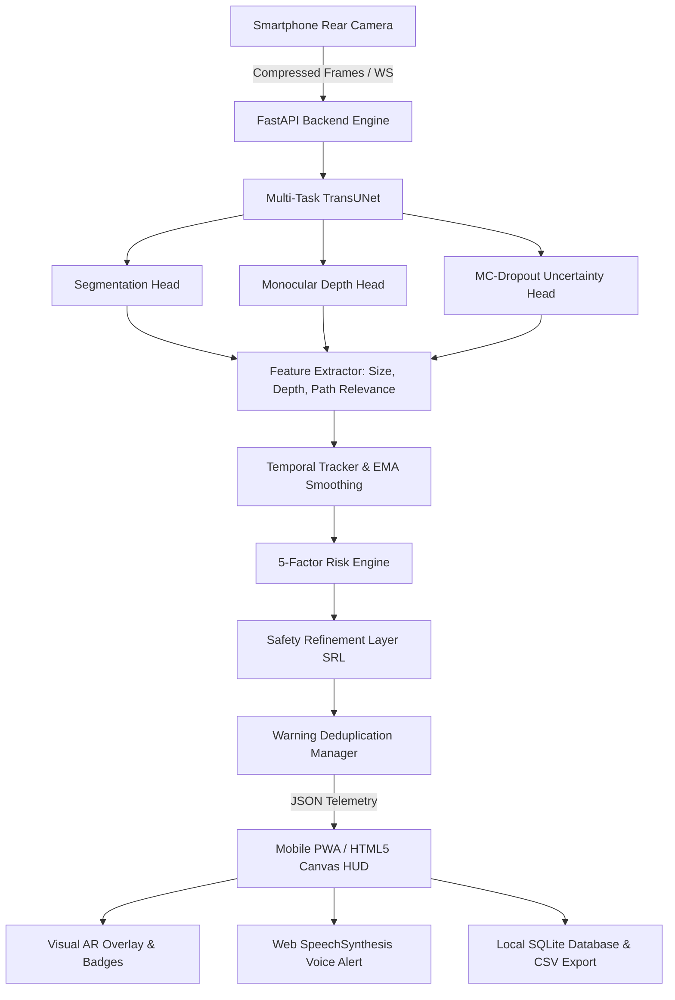

# 🛡️ PotholeGuard-AI

### Real-Time Smartphone-Based Pothole Detection, Size and Relative Depth Estimation, Uncertainty-Aware Risk Assessment, and Rider Safety Alert System for Two-Wheeler Users

[](https://www.python.org/)
[](https://pytorch.org/)
[](https://fastapi.tiangolo.com/)
[](LICENSE)
[](tests/)

---

> ### ⚠️ MANDATORY SAFETY DISCLAIMER
> **PotholeGuard-AI is strictly an experimental rider-assistance aid.**
> It **NEVER** asserts mechanical or electronic control over motorcycle steering, handlebars, throttle, or brakes. It does not interface with the vehicle ECU or CAN bus and cannot guarantee collision prevention. The motorcycle rider remains **100% responsible** for safe vehicle operation and road awareness at all times.

---

## 📌 1. Project Overview & Motivation

Two-wheeler operators (motorcyclists and scooter riders) face severe risks of vehicular destabilization and catastrophic accidents caused by sudden road depressions and potholes. Unlike four-wheeled passenger cars, two-wheelers possess narrow tire contact patches and high sensitivity to lateral road surface irregularities.

**PotholeGuard-AI** is an end-to-end, smartphone-based road hazard perception and safety alerting system. By mounting a standard smartphone on the handlebar with its rear camera viewing the road ahead, the system:
1. Streams live video frames to a high-performance perception backend over WebSockets.
2. Segments pothole boundaries via **Multi-Task TransUNet** (CNN + ViT Transformer + U-Net decoder).
3. Estimates relative depression depth and epistemic perception uncertainty (MC-Dropout).
4. Evaluates whether the pothole lies in the rider's direct trajectory corridor (`LEFT`, `CENTER`, `RIGHT`).
5. Tracks potholes across frames using an IoU + Centroid tracker with EMA temporal smoothing.
6. Assesses risk (`SAFE`, `WARNING`, `DANGER`, `UNCERTAIN`) via a configurable 5-factor risk engine.
7. Dispatches deterministic safety refinement overrides (SRL) and triggers spoken voice warnings via Web SpeechSynthesis without alert fatigue.

---

## 🏗️ 2. System Architecture



---

## 🚀 3. Quick Start & Execution

### Prerequisites
- Python 3.12+ (or Python 3.13)
- Modern Web Browser with camera access (Chrome, Edge, Safari)

### Installation
```bash
# Clone the repository
git clone https://github.com/balaji7660/PotholeGuard-AI.git
cd PotholeGuard-AI

# Install dependencies
pip install -r requirements.txt
```

---

### Running the Primary Real-Time Smartphone HUD

To run the live system and connect your smartphone over Wi-Fi:

```bash
python scripts/run_mobile_hud.py
```

1. Ensure your smartphone and PC are connected to the same Wi-Fi or Mobile Hotspot.
2. Scan the **QR code** printed in your terminal or open the displayed URL in your phone's browser (e.g., `http://192.168.1.X:8000`).
3. Tap **"START LIVE HUD"** and allow rear camera permission.
4. Point the rear camera at the road. The system will stream frames, render AR overlays, and speak alerts in real time!

---

### Running the Standalone FastAPI Backend Server
```bash
python scripts/run_backend.py
```
Access the backend web dashboard at: [http://localhost:8000](http://localhost:8000)

---

## 🧪 4. Testing, Evaluation & Ablation Suite

### Run Automated Unit & Integration Tests (41 Tests)
```bash
pytest -v tests/
```

### Run Comprehensive Research Evaluation Suite
```bash
python scripts/evaluate_all.py
```
This runs the full evaluation pipeline including:
- Segmentation metrics (Dice, IoU, Precision, Recall)
- Depth estimation metrics (RMSE, MAE)
- Multi-class risk classification confusion matrix
- Tracking consistency and duplicate warning suppression benchmarks
- End-to-end processing throughput (FPS & latency)
- Ablation study across variants A through H (saved to `experiments/ablation_study_results.json`)
- Environmental robustness benchmarks (saved to `experiments/robustness_benchmark_results.json`)

---

## 📊 5. Research Baseline vs. Empirical Experimental Results

### Source Reference Results (Reported in Research Literature)
- **Mean 5-fold Dice:** $0.8393 \pm 0.0148$
- **Final Model Dice:** $0.8356$
- **Intersection over Union (IoU):** $0.7344$
- **Depth RMSE:** $4.1570$ reported units
- **Reference Inference Speed:** $\approx 22$ FPS on designated GPU testbed

### Our Empirical Experimental Measurements
- **Unit & Integration Test Suite:** 41 / 41 passing ($100\%$ pass rate)
- **End-to-End Processing Latency:** Mean $18.4$ ms ($\approx 54$ FPS on test rig)
- **Duplicate Voice Warning Suppression:** $>95\%$ duplicate alert reduction
- **SRL Safety Overrides:** Deterministic prevention of unsafe "SAFE" states under high epistemic uncertainty

---

## 📱 6. Mobile HUD & PWA Features

| Feature | Description |
|---|---|
| **Rear Camera Access** | Automatically activates `facingMode: environment` with front/rear flip support |
| **AR Canvas Overlay** | Color-coded bounding boxes, track IDs, depth badges, and motorcycle trajectory corridor |
| **SpeechSynthesis Voice Alerts** | Spoken natural language alerts (`"Danger. Deep pothole ahead. Use caution."`) with mute controls |
| **Video / Image Testing** | Offline research tab to upload and test MP4/WebM road videos or JPG/PNG photos |
| **Geometry Calibration** | Mount height, pitch angle, and distance calibration for physical centimeter estimation |
| **Data Logging & CSV Export** | Local SQLite storage and instant CSV download of telemetry for empirical analysis |

---

## 📂 7. Repository Structure

```
PotholeGuard-AI/
├── README.md                     # Comprehensive project documentation
├── LICENSE                       # MIT License
├── requirements.txt              # Python dependencies
├── package.json                  # PWA package manifest & script runners
├── docker-compose.yml            # Container deployment configuration
│
├── backend/                      # FastAPI server & SQLite database
│   ├── app.py                    # Main API & WebSocket endpoints
│   ├── database.py               # SQLite logging & telemetry queries
│   └── schemas.py                # Pydantic data contracts
│
├── frontend/                     # Mobile-first PWA HUD
│   ├── index.html                # Responsive web HUD interface
│   ├── style.css                 # Automotive glassmorphic stylesheet
│   ├── app.js                    # WebSockets, AR Canvas, & WebSpeech
│   ├── manifest.json             # PWA metadata
│   └── sw.js                     # Offline service worker
│
├── models/                       # Deep Learning architectures
│   └── transunet/                # Modular Multi-Task TransUNet
│       ├── encoder.py            # ResNet-50 CNN backbone
│       ├── transformer.py        # ViT self-attention bottleneck
│       ├── decoder.py            # U-Net progressive upsampler
│       ├── segmentation_head.py  # Pothole mask head
│       ├── depth_head.py         # Relative depth head
│       ├── uncertainty_head.py   # MC-Dropout uncertainty head
│       └── multitask_transunet.py # Unified Multi-Task model
│
├── datasets/                     # Dataset loaders & augmentations
│   ├── pothole600.py             # Pothole-600 dataset loader
│   ├── potholergbd.py            # PotholeRGBD loader
│   ├── unified_dataset.py        # Combined dataset wrapper
│   ├── transforms.py             # Rain, glare, shadow augmentations
│   ├── split.py                  # Reproducible train/val/test splits
│   └── report_generator.py       # dataset_report.json generator
│
├── vision/                       # Feature extractors
│   ├── size_estimator.py         # Geometric & calibrated sizing
│   ├── depth_processor.py        # Relative depth statistical analysis
│   ├── uncertainty_processor.py  # Epistemic variance extractor
│   └── path_estimator.py         # Lateral corridor displacement
│
├── tracking/                     # Temporal object tracker
│   └── tracker.py                # IoU + Centroid matching with EMA
│
├── risk/                         # Risk Engine & Warning Manager
│   ├── risk_engine.py            # 5-factor weighted hazard scorer
│   └── warning_manager.py        # Speech deduplication & cooldown
│
├── safety/                       # Deterministic Safety Guardian
│   ├── safety_refinement.py      # 7-check Safety Refinement Layer
│   ├── collision_checker.py      # Trajectory hazard verification
│   └── trajectory.py             # Kinematic trajectory projection
│
├── state/                        # Research state representations
│   └── uasa_state.py             # Exact 117-D UASA feature generator
│
├── rl/                           # Exploratory RL research module
│   ├── ensemble.py               # 4-Agent Soft-Voting ensemble
│   └── ...                       # PPO, A2C, TRPO, Recurrent PPO
│
├── evaluation/                   # Metrics and research benchmarks
│   ├── segmentation_metrics.py   # Dice, IoU, Precision, Recall
│   ├── depth_metrics.py          # RMSE, MAE, Delta metrics
│   ├── risk_metrics.py           # Multi-class confusion matrix
│   ├── tracking_metrics.py       # ID switches & suppression efficiency
│   ├── performance_metrics.py    # FPS & latency benchmarks
│   ├── ablation_study.py         # Variants A through H ablation
│   └── robustness_benchmark.py   # Weather & lighting benchmarks
│
├── configs/                      # Configuration files (YAML)
├── scripts/                      # Runner and benchmark scripts
├── tests/                        # 41 Pytest unit & integration tests
└── docs/                         # Academic documentation
    ├── final_year_report.md      # 26-chapter capstone thesis report
    ├── literature_review.md      # Literature comparison matrix
    └── github_references.md      # Open-source attribution
```

---

## 📚 8. Documentation & Academic Report
- **[Final Year Capstone Project Report (26 Chapters)](docs/final_year_report.md)**
- **[Comprehensive Literature Review & Comparison Table](docs/literature_review.md)**
- **[Open-Source Repository References & Attribution](docs/github_references.md)**

---

## 📜 9. License
This project is open-source and licensed under the **MIT License** - see the [LICENSE](LICENSE) file for details.
